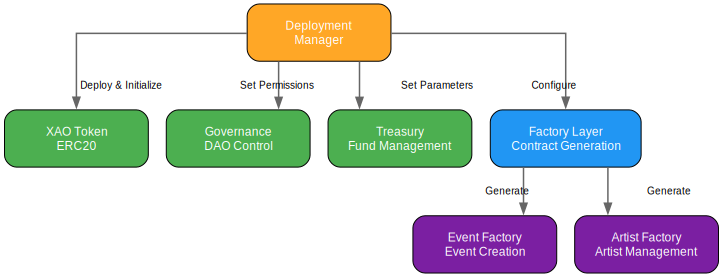
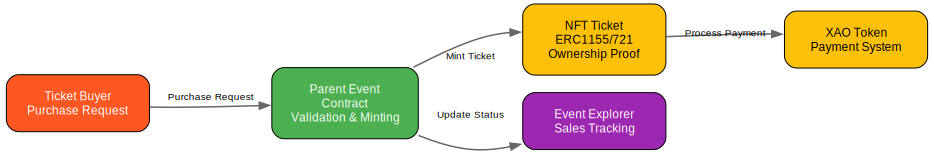

# NFT Ticketing Smart Contract System

A Solidity-based NFT ticketing system with separate Parent Event and Artist contracts, focusing on validation rather than NFT attribute storage.

## Website
Visit [XAO Protocol](https://xao.fun) - The Future of Event Ticketing


## Smart Contracts Overview

### Core Contracts

#### 1. ParentEventContract
The main contract managing event creation and ticket sales.
- **Key Features**:
  - NFT-based ticketing (ERC721)
  - Dynamic pricing system with early bird discounts and demand-based adjustments
  - Multi-tier pricing support for different ticket categories
  - Escrow payment handling with secure fund management
  - Artist contract integration for performance management
  - Cancellation system with graduated penalties based on timing
- **Technical Details**:
  - Uses OpenZeppelin's ERC721 implementation for NFT functionality
  - Implements ReentrancyGuard for payment security
  - Custom ticket pricing algorithms based on demand and timing
  - Event-specific revenue sharing calculations
- **Security Features**:
  - ReentrancyGuard for payment operations
  - Ownership controls with OpenZeppelin's Ownable
  - Time-based validations for all critical operations
  - Secure payment processing with escrow mechanism
  - Graduated cancellation penalties
- **API Functions**:
  ```solidity
  // Set event details
  function setEventDetails(
      string memory _eventName,
      string memory _eventAddress,
      string memory _venueName,
      uint256 _eventDate,
      uint256 _eventStartTime,
      uint256 _eventEndTime,
      string memory _legalText
  ) external;

  // Configure ticketing
  function setTicketingDetails(
      uint256 _ticketSupply,
      uint256 _ticketPrice,
      bool _dynamicPricingEnabled
  ) external;

  // Purchase ticket
  function mintTicket(address to) external payable returns (uint256);

  // Cancel event
  function cancelEvent() external;
  ```

#### 2. ArtistContract
Manages artist-specific functionality and performance agreements.
- **Key Features**:
  - Performance scheduling with detailed timing controls
  - Technical rider management for equipment and setup
  - Revenue share calculation with guarantee amounts
  - Cancellation handling with tiered penalties
  - Deposit management for performance security
- **Technical Details**:
  - Custom deposit handling mechanism
  - Time-window based cancellation system
  - Automated penalty calculations
  - Integration with ParentEventContract for payments
- **Security Features**:
  - Time-locked operations for critical functions
  - Graduated cancellation penalties (10%, 50%, 100%)
  - Secure payment processing with escrow
  - Access control for artist-specific operations
- **API Functions**:
  ```solidity
  // Set artist details
  function setArtistDetails(
      uint256 _loadInTime,
      uint256 _setTime,
      string memory _rider,
      string memory _legalText,
      uint256 _guaranteeAmount,
      uint256 _revenueShare
  ) external;

  // Sign contract
  function signContract() external;

  // Cancel performance
  function cancelPerformance() external;

  // Withdraw deposit
  function withdrawDeposit() external;
  ```

### Factory Contracts

#### 1. EventFactory
Creates and manages event contract instances.
- **Key Features**:
  - Event contract deployment with configuration
  - Fee collection and management
  - Event tracking and enumeration
  - Artist factory integration for linking
- **Gas Optimization**:
  - Minimal storage usage
  - Efficient event tracking
  - Optimized deployment pattern
- **API Functions**:
  ```solidity
  // Create new event
  function createEvent() external payable returns (address);

  // Update creation fee
  function updateEventCreationFee(uint256 _newFee) external;

  // Get events
  function getEvents(uint256 start, uint256 end) external view returns (address[] memory);
  ```

#### 2. ArtistFactory
Manages artist contract creation and event linkage.
- **Key Features**:
  - Artist contract deployment
  - Event contract linking mechanism
  - Artist tracking system
  - Multi-event support for artists
- **Gas Optimization**:
  - Optimized storage layout
  - Efficient mapping structure
  - Minimal state changes
- **API Functions**:
  ```solidity
  // Create artist contract
  function createArtistContract(address _eventContract, address _artist) external returns (address);

  // Get artist contracts
  function getEventArtists(address _eventContract) external view returns (address[] memory);
  ```

#### 4. EventExplorer
Central registry and explorer for all events in the platform.
- **Key Features**:
  - Event registration and status tracking
  - Artist management functionality
  - Ticket availability monitoring
  - Revenue tracking system
  - Wallet-based access control
- **Technical Details**:
  - Event status enumeration
  - Artist status tracking
  - Comprehensive event information storage
  - Private revenue data management
- **Security Features**:
  - Authorized viewer system
  - Status update controls
  - Revenue data privacy
  - Event registration validation

#### 5. EventTicketERC1155
Multi-token standard implementation for flexible ticket tiers.
- **Key Features**:
  - Multiple ticket tier support
  - Royalty system implementation
  - Reseller approval system
  - Supply management per tier
- **Technical Details**:
  - ERC1155 standard compliance
  - Automated royalty calculations
  - Tier-based access control
  - Transfer validation system
- **Security Features**:
  - Role-based permissions
  - Transfer restrictions
  - Supply validation
  - Royalty enforcement

#### 6. XAOMarketing
Campaign management and AI-driven dispute resolution.
- **Key Features**:
  - Campaign creation and tracking
  - Budget management system
  - AI-powered arbitration
  - Multi-sig treasury control
- **Technical Details**:
  - Time-based campaign scheduling
  - Evidence submission system
  - AI decision integration
  - Appeal process management
- **Security Features**:
  - Dispute resolution timeframes
  - Multi-stage approval process
  - Budget initialization controls
  - Campaign state validation


## Contract Flow Diagrams

### 1. Contract Deployment Flow
```
                                    ┌──────────────┐
                                    │  Deployment  │
                                    └──────┬───────┘
                    ┌───────────────────┬──┴────┬───────────────┐
            ┌───────┴──────┐    ┌──────┴───┐   └────┐    ┌─────┴─────┐
            │  XAO Token   │    │Governance│        │    │  Treasury  │
            └──────────────┘    └──────────┘        │    └───────────┘
                                                    │
                                            ┌───────┴──────┐
                                            │   Factory    │
                                            │  Contracts   │
                                            └──────┬───────┘
                                        ┌─────────┴────────┐
                                  ┌─────┴─────┐      ┌─────┴─────┐
                                  │   Event   │      │   Artist  │
                                  │  Factory  │      │  Factory  │
                                  └───────────┘      └───────────┘
```
The deployment flow shows the hierarchical relationship between core system contracts. The XAO Token, Governance, and Treasury contracts form the foundation, while factory contracts enable the creation of event and artist instances.

<details>
<summary>View SVG Diagram</summary>

</details>

### 2. Event Creation Flow
```
┌─────────┐     ┌───────────────┐     ┌─────────────────┐
│  Owner  │────▶│ Event Factory │────▶│ Parent Event    │
└─────────┘     └───────┬───────┘     └────────┬────────┘
                        │                       │
                        │                       ▼
                        │             ┌─────────────────┐
                        │             │  Event Explorer │
                        │             └────────┬────────┘
                        ▼                      │
              ┌─────────────────┐             │
              │ Artist Factory  │◀────────────┘
              └───────┬─────────┘
                      │
                      ▼
              ┌─────────────────┐
              │Artist Contract  │
              └─────────────────┘
```
When creating a new event, the owner initiates the process through the Event Factory, which deploys a new Parent Event contract. The Event Explorer tracks this new event, and the Artist Factory creates associated artist contracts based on the event requirements.

<details>
<summary>View SVG Diagram</summary>

</details>

### 3. Ticket Sales Flow
```
┌──────────┐    ┌────────────────┐    ┌───────────────┐
│  Buyer   │───▶│ Parent Event   │───▶│ ERC1155/721   │
└──────────┘    │   Contract     │    │  Ticket NFT   │
                └────────┬───────┘    └───────┬───────┘
                        │                     │
                        ▼                     ▼
                ┌────────────────┐    ┌───────────────┐
                │ Event Explorer │    │  XAO Token    │
                └────────────────┘    └───────────────┘
```
The ticket sales process starts with a buyer interacting with the Parent Event contract, which mints NFT tickets (either ERC1155 or ERC721). The Event Explorer tracks ticket availability and sales, while XAO Tokens handle the payment aspects.

<details>
<summary>View SVG Diagram</summary>

</details>

### 4. Revenue Distribution Flow
```
┌────────────────┐    ┌────────────────┐    ┌───────────────┐
│  Ticket Sale   │───▶│ Parent Event   │───▶│ XAO Treasury  │
└────────────────┘    │   Contract     │    └───────┬───────┘
                      └────────┬───────┘            │
                              │                     ▼
                              ▼               ┌───────────────┐
                      ┌────────────────┐     │Artist Contract│
                      │Revenue Splitter│────▶│    Escrow     │
                      └────────────────┘     └───────────────┘
```
After a ticket sale, the revenue flows through the Parent Event contract to the XAO Treasury. The Revenue Splitter then distributes the funds according to predefined shares, with artist payments held in escrow until performance obligations are met.

<details>
<summary>View SVG Diagram</summary>

</details>

### AI-Powered Arbitration Implementation

The project uses Coinbase's CDP (Counterparty Decision Protocol) Agent for handling arbitration cases. The implementation is in TypeScript and consists of the following key components:

#### Key Files
- `services/arbitration-cdp-agent.ts`: Core CDP agent implementation
- `services/arbitration-example.ts`: Example usage and testing
- `global.d.ts`: Type definitions for CDP integration

#### Environment Setup
To use the CDP arbitration system, the following environment variables are required:
```bash
OPENAI_API_KEY=your_openai_api_key
CDP_API_KEY_NAME=your_cdp_key_name
CDP_API_KEY_PRIVATE_KEY=your_cdp_private_key
NETWORK_ID=base-sepolia  # Optional, defaults to base-sepolia testnet
```

#### Running the CDP Agent
To test the CDP arbitration system:
```bash
cd services
ts-node arbitration-example.ts
```

This will demonstrate:
- Contract terms analysis
- Evidence processing
- AI-driven decision generation
- Payment and penalty calculations

#### Architecture Diagrams
The project includes automatically generated architecture diagrams using GraphViz. To regenerate the diagrams:
```bash
python3 generate_diagrams.py
```

This will create SVG diagrams in the `attached_assets` directory showing:
- Deployment flow
- Event creation flow
- Ticket sales flow
- Revenue distribution flow
- Arbitration flow


## Contract Upgrade Patterns

### Security Considerations
- Use OpenZeppelin's transparent proxy pattern for upgrades
- Implement proper storage patterns for upgrade safety
- Include comprehensive security checks in constructors
- Validate all state changes through modifiers

### Gas Optimization Tips
1. EventFactory
   - Batch create events when possible
   - Use minimal proxy pattern for deployment
   - Optimize array operations

2. ArtistFactory
   - Implement efficient storage patterns
   - Minimize state changes
   - Use events for off-chain tracking

3. ParentEventContract
   - Optimize ticket minting process
   - Use efficient pricing calculations
   - Implement batch operations where possible

4. ArtistContract
   - Optimize deposit handling
   - Efficient penalty calculations
   - Minimize storage operations

## Audit Checklist

### Security
- [ ] Access control implementation
- [ ] Reentrancy protection
- [ ] Integer overflow protection
- [ ] Proper event emission
- [ ] Secure randomness if used
- [ ] Time manipulation protection

### Gas Optimization
- [ ] Efficient storage layout
- [ ] Minimal state changes
- [ ] Optimized loops and arrays
- [ ] Proper use of view/pure functions
- [ ] Gas-efficient math operations

### Functionality
- [ ] Event creation and management
- [ ] Ticket minting and transfers
- [ ] Artist contract integration
- [ ] Payment processing
- [ ] Cancellation handling

## Contract Interactions

### Event Creation Flow
1. EventFactory deploys ParentEventContract
   - Validates deployment parameters
   - Collects creation fee
   - Sets up initial configuration
2. ArtistFactory creates ArtistContract
   - Links to parent event
   - Sets up artist parameters
3. Contracts are linked through factory references
   - Validates relationships
   - Establishes communication channels
4. Event details and ticketing configured
   - Sets pricing tiers
   - Configures dynamic pricing
   - Establishes event parameters

### Ticketing Process
1. ParentEventContract mints NFT tickets
   - Validates purchase parameters
   - Applies dynamic pricing
   - Records transaction details
2. Dynamic pricing adjusts based on demand
   - Calculates current tier pricing
   - Applies early bird discounts
   - Adjusts for demand factors
3. Revenue split calculated for artists
   - Computes base amounts
   - Applies percentage shares
   - Handles guarantee amounts
4. Payments processed through escrow
   - Validates payment amounts
   - Handles splits and distributions
   - Processes refunds if needed

### Artist Management
1. ArtistContract sets performance details
   - Records technical requirements
   - Sets timeline parameters
   - Establishes payment terms
2. Revenue shares and guarantees configured
   - Sets base guarantee amounts
   - Configures percentage splits
   - Establishes payment schedules
3. Deposits managed for security
   - Handles initial deposits
   - Manages escrow amounts
   - Processes withdrawals
4. Cancellation penalties enforced
   - Calculates penalty windows
   - Applies graduated penalties
   - Processes refunds

## Security Features

### Payment Security
- ReentrancyGuard implementation for all payment functions
- Escrow-based payment processing with validation
- Secure withdrawal patterns with checks
- Fee validation and collection mechanisms
- Multi-step payment processing

### Access Control
- Role-based permissions system
- Owner-only functions with checks
- Artist-specific controls and validation
- DAO governance integration for approvals
- Time-locked administrative functions

### Time Management
- Graduated cancellation windows with validation
- Time-locked operations for critical functions
- Event scheduling validation system
- Performance time constraints and checks
- Automated time-based state transitions

### Economic Security
- Tiered pricing system with bounds
- Deposit requirements and management
- Cancellation penalties with graduated rates
- Revenue share calculations with validation
- Dynamic pricing controls and limits

## Testing and Deployment

### Test Coverage
The project includes comprehensive tests covering:
```javascript
// Example test structure
describe("Contract", () => {
  describe("Initialization", () => {
    // Contract deployment tests
  });

  describe("Core Functions", () => {
    // Main functionality tests
  });

  describe("Security Features", () => {
    // Security mechanism tests
  });
});
```

### Test Categories
- Event setup and validation
- Ticket minting and revenue tracking
- Artist contract linking and management
- Dynamic pricing calculations
- Cancellation penalty enforcement
- Payment processing and escrow
- Security feature verification
- Access control validation
- Time management checks
- Economic security validation

## Contract Dependencies
- OpenZeppelin Contracts
  - ERC721 for NFT ticketing
  - Ownable for access control
  - ReentrancyGuard for payment security
  - SafeMath for calculations
  - Access Control for roles

## Development Stack
- Solidity ^0.8.19
- Truffle Framework
- OpenZeppelin Contracts
- Web3.js
- TypeScript (CDP Agent Implementation)

## Prerequisites
- Node.js >= 16.0.0
- Truffle Suite
- Ganache CLI (for local development)
- TypeScript


## Installation
1. Clone the repository
```bash
git clone <your-repo-url>
cd nft-ticketing-system
```

2. Install dependencies
```bash
npm install
```

3. Set up environment variables
```bash
OPENAI_API_KEY=your_api_key_here
CDP_API_KEY_NAME=your_cdp_key_name
CDP_API_KEY_PRIVATE_KEY=your_cdp_private_key
NETWORK_ID=base-sepolia  # Optional, defaults to base-sepolia testnet
```

4. Start local blockchain
```bash
npx ganache-cli
```

5. Compile contracts
```bash
npx truffle compile
```

6. Run migrations
```bash
npx truffle migrate
```

7. Run tests
```bash
npx truffle test
```

## Project Structure
```
├── contracts/           # Smart contracts
│   ├── interfaces/     # Contract interfaces
│   ├── ParentEvent.sol # Main event contract
│   ├── Artist.sol      # Artist contract
│   └── XAOReferral.sol # Referral contract
├── migrations/         # Deployment scripts
├── services/          # Backend services
│   └── arbitration-cdp-agent.ts
│   └── arbitration-example.ts
│   └── global.d.ts
├── test/              # Test files
└── scripts/           # Utility scripts
```

## License
MIT

## Contributing
Contributions are welcome! Please feel free to submit a Pull Request.